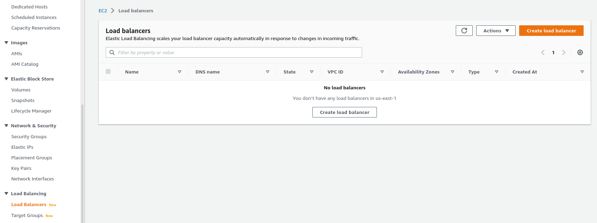
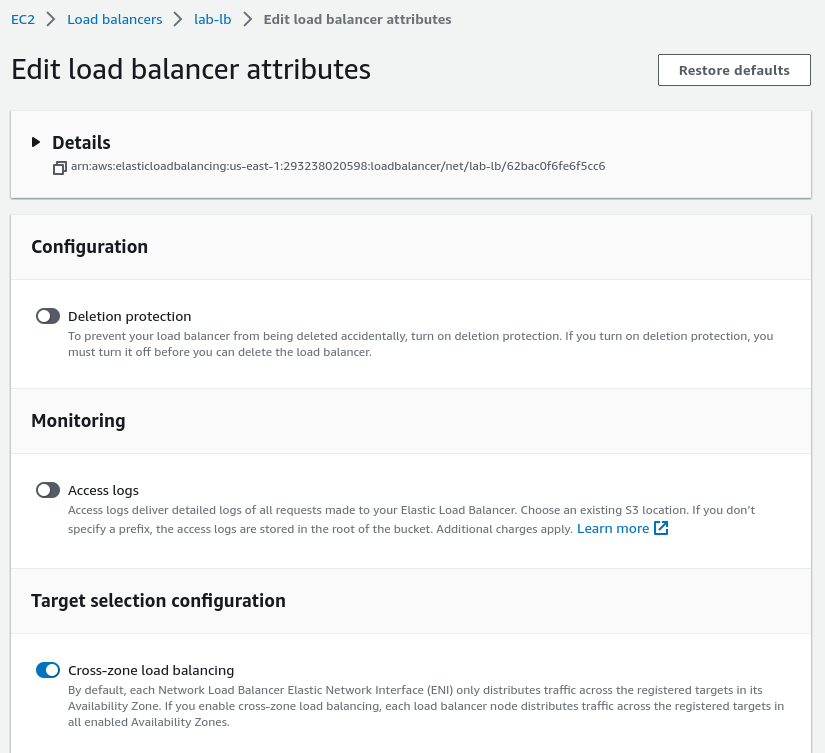
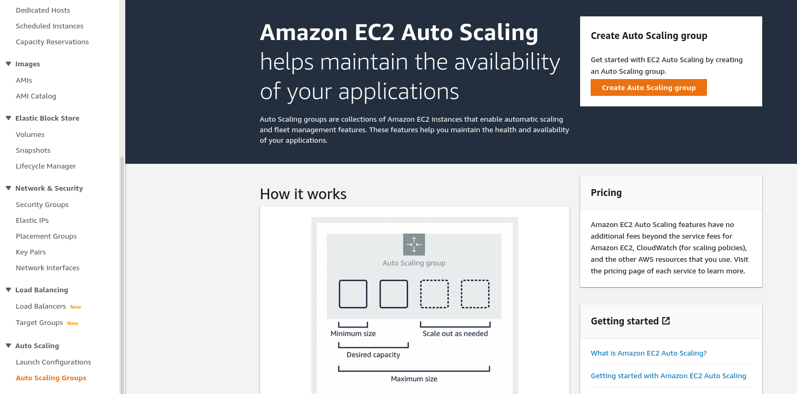

# AWS Networking Lab


## Learning Goals

- Understanding VPCs
- Understanding Public/Private Subnets
- Understanding Routing Tables
- Understanding Network ACLs
- Understanding Gateways
- Understanding Load Balancing
- Understanding Auto Scaling


## Instructions

We will be getting some hands on experience with designing a non-trivial
network setup in this lab. We will be utilizing a new VPC, and many of
the networking components available in AWS to stand up a more robust
version of the previous application.

Many of these components have comparable equivalents with physical
network setups, meaning that many of those best practices for traditional
systems can be brought over into the cloud. E.g. Network and route
redundancy, least privilege of networking rules, and a certain level
of network partitioning.

Once complete, our new environment will be laid out as follows:


> Note: For all examples in this lab, use the explicit names, ports,
> Subnet ranges, and other values as specified(other than individual
> node IP addresses). These are not hard requirements to get a working
> cloud application, but are hard requirements for successful testing
> of this lab environment.


## Creating a New VPC

Let us start by creating a new Virtual Private Cloud(VPC) for this
application.

We had used the default VPC in the previous lab, which gets created
with some default configurations when getting started in AWS. However,
for most non-trivial applications we will want a more customized
approach.

We can start by viewing our currently available VPCs. The only one
available at this point should be the default one in our account:


Select to create a new one, which we will name `lab-vpc`. We will use
the option to auto-generate several more of the components for us.


All these additional features can be created and configured manually
as well, but this helpful auto-generation will give us a good start
with Public/Private Subnets spanning redundant Availability Zones,
basic Routing Tables to route IP traffic into and out of our Subnets,
and basic Network ACLs setup to restrict access into and out of our
Subnets based on more granular rules.

Make sure to select the following configurations, with defaults for
everything else:


Once complete, validate that the new `lab-vpc` VPC is Available:


## Creating Additional Network ACLs

As mentioned, there is a basic Network ACL created and attached to the
new Subnets: 


As we are setting up a Public/Private networking split however, we
will want to create new Networking ACLs to use. One specifically for
the Public Subnet components, and one for the Private ones. This will
allow us to specify fairly restrictive rules for our more secure
Private components, while keeping the Public side more open and
accessible.

Go ahead and create the following `lab-public` and `lab-private`
Network ACLs:


Once complete, we will be able to see these new unassociated ACLs:


We do still need to add the individual networking rules, and associate
them with the correct Subnets. The Inbound/Outbound rules are modified
in the same way we've already done with Security Groups prior, and
associations can be modified under the `Subnet associations` pane.

For the Public Subnets, we do want to allow all traffic in and out, so
we can set the following rules:


However, for the Private Subnet, we ideally want to restrict Network
ACLs so that only our Public Subnet can talk with our Private Subnet.
Purely Private Subnets with zero Internet accessibility are tricky to
manage though.

We'll be starting at first with just HTTP/HTTPS rules to allow our
Redis Docker Image to be pulled down, and address some more needed
rules as they come up. The below ones should be a good start for us
for now:


And to finish configuring the Network ACLs, bind them to their
relevant Subnets:


## Creating the EC2 Instances

Now that we have the initial network environments setup, we can create
our same Redis Application and Server instances again.

Go ahead and create these systems again following the same process we
went though in the previous lab, using the AMI we had previously
created. There should only be a few extra configurations(shown below)
needed to have these make use of our new VPC and Subnets.

Create `application-server-1` and `application-server-2` instances on
the Public Subnets, and `database-server-1` on the first Private
Subnet:


Once these systems are created and showing as available, we can SSH
into and validate them using the Publicly addressable IP address:

``` text
ssh -i flatironschool-ec2-key.pem ubuntu@44.192.42.183 
```
``` shell
The authenticity of host '44.192.42.183 (44.192.42.183)' can't be established.
ED25519 key fingerprint is SHA256:5+c2DTIaHAYA2PoDZVFl8uRntVknTgKas8sL3C6fxQk.
This key is not known by any other names
Are you sure you want to continue connecting (yes/no/[fingerprint])? yes
Warning: Permanently added '44.192.42.183' (ED25519) to the list of known hosts.
Welcome to Ubuntu 22.04.1 LTS (GNU/Linux 5.15.0-1026-aws x86_64)

 * Documentation:  https://help.ubuntu.com
 * Management:     https://landscape.canonical.com
 * Support:        https://ubuntu.com/advantage

  System information as of Tue Dec  6 17:02:23 UTC 2022

  System load:  0.0               Processes:                99
  Usage of /:   28.8% of 7.57GB   Users logged in:          0
  Memory usage: 24%               IPv4 address for docker0: 172.17.0.1
  Swap usage:   0%                IPv4 address for eth0:    10.0.11.106


9 updates can be applied immediately.
8 of these updates are standard security updates.
To see these additional updates run: apt list --upgradable


Last login: Tue Dec  6 16:35:22 2022 from XX.XX.XX.XX
ubuntu@ip-10-0-11-106:~$
```

``` text
ssh -i flatironschool-ec2-key.pem ubuntu@3.84.22.180
```
``` shell
The authenticity of host '3.84.22.180 (3.84.22.180)' can't be established.
ED25519 key fingerprint is SHA256:xUWdRZFuuoUxzW4wrcZbutX3fR8CYS/kg2uyVhpqmkw.
This key is not known by any other names
Are you sure you want to continue connecting (yes/no/[fingerprint])? yes
Warning: Permanently added '3.84.22.180' (ED25519) to the list of known hosts.
Welcome to Ubuntu 22.04.1 LTS (GNU/Linux 5.15.0-1026-aws x86_64)

 * Documentation:  https://help.ubuntu.com
 * Management:     https://landscape.canonical.com
 * Support:        https://ubuntu.com/advantage

  System information as of Tue Dec  6 17:03:09 UTC 2022

  System load:  0.0               Processes:                99
  Usage of /:   28.8% of 7.57GB   Users logged in:          0
  Memory usage: 24%               IPv4 address for docker0: 172.17.0.1
  Swap usage:   0%                IPv4 address for eth0:    10.0.21.148


9 updates can be applied immediately.
8 of these updates are standard security updates.
To see these additional updates run: apt list --upgradable


Last login: Tue Dec  6 16:35:22 2022 from XX.XX.XX.XX
ubuntu@ip-10-0-21-148:~$
```

However, our Database instance in the Private Subnet does not have a
Publicly addressable IP assigned. How do we SSH into this machine if
this is the case? This is where a concept know as a Bastion or Jump
hosts comes into play as one of many solutions.

Frequently with a locked down Private network, there will be a
hardened system available on a Public Subnet with Network Policies
configured to allow SSH access through to the Private side. These are
known as Bastion hosts or Jump hosts, and provide a single hardened
point of entry into the more secure environments. As SSH is a
point-to-point protocol, you can SSH to the Bastion Host, and then
from the Bastion Host open another SSH connection into the restricted
Private Network. Virtual Private Networks(VPNs) are another common
system that can be setup to achieve this same internal access
functionality.

For this lab, we will be making use of features in the SSH CLI tool
that transparently handle this process for us. As our Public/Private
Subnet split is fairly simplistic, any of our Public hosts can be used
as a Bastion/Jump system.

We'll start with a few helper commands to allow our SSH agent to
handle our certificate files more easily:

``` text
eval "$(ssh-agent -s)"
```
``` shell
Agent pid 120628
```
``` text
ssh-add flatironschool-ec2-key.pem
```
``` shell
Identity added: flatironschool-ec2-key.pem (flatironschool-ec2-key.pem)
```

After this is done, and from the same terminal session, the following
syntax can be used to indicate the intermediary Jump Host, and the
subsequent Private IP address:

``` text
ssh -J ubuntu@44.192.42.183 ubuntu@10.0.134.128
```
``` shell
The authenticity of host '10.0.134.128 (<no hostip for proxy command>)' can't be established.
ED25519 key fingerprint is SHA256:k8c4FXIf1t10EDsewpCYlDd8znLjluFxKy0F/Fao/IE.
This key is not known by any other names
Are you sure you want to continue connecting (yes/no/[fingerprint])? yes
Warning: Permanently added '10.0.134.128' (ED25519) to the list of known hosts.
Welcome to Ubuntu 22.04.1 LTS (GNU/Linux 5.15.0-1026-aws x86_64)

 * Documentation:  https://help.ubuntu.com
 * Management:     https://landscape.canonical.com
 * Support:        https://ubuntu.com/advantage

  System information as of Tue Dec  6 17:37:07 UTC 2022

  System load:  0.0               Processes:                98
  Usage of /:   28.8% of 7.57GB   Users logged in:          0
  Memory usage: 25%               IPv4 address for docker0: 172.17.0.1
  Swap usage:   0%                IPv4 address for eth0:    10.0.134.128


9 updates can be applied immediately.
8 of these updates are standard security updates.
To see these additional updates run: apt list --upgradable


Last login: Tue Dec  6 16:35:22 2022 from XX.XX.XX.XX
ubuntu@ip-10-0-134-128:~$ 
```

Once all these systems have been validated, we can launch the needed
Docker applications on the three systems.


One instance of Redis-Commander on the first Application server:

``` text
ssh ubuntu@44.192.42.183
```
``` shell
Welcome to Ubuntu 22.04.1 LTS (GNU/Linux 5.15.0-1026-aws x86_64)

 * Documentation:  https://help.ubuntu.com
 * Management:     https://landscape.canonical.com
 * Support:        https://ubuntu.com/advantage

  System information as of Tue Dec  6 18:01:59 UTC 2022

  System load:  0.0               Processes:                105
  Usage of /:   28.8% of 7.57GB   Users logged in:          1
  Memory usage: 27%               IPv4 address for docker0: 172.17.0.1
  Swap usage:   0%                IPv4 address for eth0:    10.0.11.106

 * Ubuntu Pro delivers the most comprehensive open source security and
   compliance features.

   https://ubuntu.com/aws/pro

9 updates can be applied immediately.
8 of these updates are standard security updates.
To see these additional updates run: apt list --upgradable


Last login: Tue Dec  6 17:12:56 2022 from XX.XX.XX.XX
```
``` text
ubuntu@ip-10-0-11-106:~$ docker run --rm --name redis-commander -d -p 80:8081 rediscommander/redis-commander:latest
```
``` shell
Unable to find image 'rediscommander/redis-commander:latest' locally
latest: Pulling from rediscommander/redis-commander
339de151aab4: Pull complete 
f732fa32fc61: Pull complete 
ef60bb667d5a: Pull complete 
4f50fa5032a4: Pull complete 
Digest: sha256:19cd0c49f418779fa2822a0496c5e6516d0c792effc39ed20089e6268477e40a
Status: Downloaded newer image for rediscommander/redis-commander:latest
f1421ad5786ef324365cca3ad652caf6400de66941674e211b11f6fbadc8fee2
```

One instance of Redis-Commander on the second Application server:

``` text
ubuntu@ip-10-0-21-148:~$ docker run --rm -u root --name redis-commander -d -p 80:8081 rediscommander/redis-commander:latest /bin/sh -c "sed -i -e 's/#333333/#1d1dc8/g' -e 's/#222222/#32c61d/g' /redis-commander/web/static/css/default.css && exec /redis-commander/docker/entrypoint.sh"
```
``` shell
Unable to find image 'rediscommander/redis-commander:latest' locally
latest: Pulling from rediscommander/redis-commander
339de151aab4: Pull complete 
f732fa32fc61: Pull complete 
ef60bb667d5a: Pull complete 
4f50fa5032a4: Pull complete 
Digest: sha256:19cd0c49f418779fa2822a0496c5e6516d0c792effc39ed20089e6268477e40a
Status: Downloaded newer image for rediscommander/redis-commander:latest
2b273acabcfc974ff66284153feda3b1c012b87e3e7cfe95d79c6b8ed4224488
```

> Note: We are modifying the Docker command here to change the color
> scheme of the UI, making it more readily distinctive during testing.


And one instance of Redis on the single Database server:

``` text
ubuntu@ip-10-0-134-128:~$ docker run --rm --name redis -d -p 6379:6379 redis
```
``` shell
Unable to find image 'redis:latest' locally
docker: Error response from daemon: Get "https://registry-1.docker.io/v2/": net/http: request canceled while waiting for connection (Client.Timeout exceeded while awaiting headers).
See 'docker run --help'.
```

At this point we do see that our Private Subnet is not configured
appropriately to allow this outgoing HTTPS connection to work.

As mentioned prior, setting up true Internet inaccessible Networks can
take quite a lot of work and design, and do require all the specifics
of the given application to be considered. Especially with recent
programming languages, frameworks, and platforms with complex
dependencies, this can be a fairly difficult task. In addition,
keeping systems up to date and patched can also be a challenge.

One common way to accomplish this would be to generate a completely
self-contained AMI. Another common setup is to configure
controlled proxies or mirrors on the Public Subnet side, and route all
traffic through these.

For this lab case we are going with a more straightforward setup of
using a NAT Gateway. This will give us some security when granting our
machines Internet access, by obfuscating the backend IP addresses and
allowing these backend servers to control the opening of connections.


## NAT Gateways

Before we get started with the NAT Gateway setup, there is one more
minor network configuration needed to allow this traffic access.

If you are familiar with how Security Groups or Firewall tables work,
one important behavior of those is missing when we shift to using
Network ACLs to control our network traffic. While Security Groups
and Firewall Tables are Stateful, Network ACLs are Stateless. This
means that we are not tracking allowed outgoing connections, and
automatically allowing the associated incoming responses. To work
around this, we'll need to also add an inbound rule to allow the
ephemeral port range for our Ubuntu OS systems. Keep in mind, these
values do differ by OS setup:


Let's now navigate to the NAT Gateway menu, and create a new NAT
Gateway:


We'll be placing this onto our Public Subnet, and allocating a new
Elastic IP to be used.


Once this Gateway is up, navigate to the associated Route Table for
the Private Subnet we are using, and add a new Destination to route
Internet destined traffic to our new NAT Gateway:


At this point, we should be able to successfully pull our Redis Docker
Image:

``` text
ubuntu@ip-10-0-134-128:~$ docker run --rm --name redis -d -p 6379:6379 redis
```
``` shell
Unable to find image 'redis:latest' locally
latest: Pulling from library/redis
025c56f98b67: Pull complete 
060e65aed679: Pull complete 
b95291e865b7: Pull complete 
7b879d654837: Pull complete 
4538783c407f: Pull complete 
ec5078f7c4e4: Pull complete 
Digest: sha256:dfeb5451fce377ab47c5bb6b6826592eea534279354bbfc3890c0b5e9b57c763
Status: Downloaded newer image for redis:latest
3ecfa711d8e48e2d6a39790fd037af922d8fcb70efc87898087cbc6a63e2f750
```


## Setting Up a Load Balancer

Once these systems are running, we should now be able to access the
Application instances in our browser by Public IP. After adding the
needed Security Group rule for our Redis Database(recall from the
previous lab), we should also be able to add the backend Redis Server
as before.

The first application instance UI should look the same, and the second
should have different banner colors:


Once these are both running, we can configure them behind a Load
Balancer.


We'll navigate to the Load Balancer menu:



And create a new Load Balancer of type `Network Load Balancer`:


We'll be making this an external Internet facing Load Balancer
named `lab-lb`:


And mapping it to use our two Public Subnets:


For now we will be creating a single Listener as an Ingress point for
our HTTP Application traffic, and have it route our traffic to a new
target group containing our application servers named `lab-lb-group`:


We can either create our group separately, or launch from the
indicated link. We'll be using the following Group Configuration
options, with everything else set to the defaults:


Once the group has been attached:


We can complete the Load Balancer setup, and confirm it is in an
Active state:


For the sake of visibility, we will want to enable the Cross-zone load
balancing Attribute:



After which we will be able to navigate to the LB DNS name in a
browser. If we refresh enough times, we should see both Application
Instances eventually serving traffic to us:


## Auto Scaling

With a working Load Balancer configured, we can also create an Auto
Scaling group, and have it configured to automatically add new
instances behind this Load Balancer. Setups like this might be useful
for automatically scaling and handling changes of resources for
unpredictable applications.


We'll navigate to the Auto Scaling Groups menu:



And start creating a new group called `lab-scaling-group`:


As this is the first group we have created, we'll have to follow the
link to create a new launch template. We'll title this `lab-template`
and configure it as follows:


Under Advanced Configurations, we'll also want to set the below User
Data to automatically launch and configure the Docker Container on VM
start:


Create this Launch Template, and then select to use it for the Auto
Scaling creation:


Go through the steps using the following configurations, leaving
defaults for everything else not mentioned:


Once completed you can confirm the new instance has started:


And we can SSH into this new instance using the Public IP given to it,
and validate that the application has started correctly on the initial
launch:

``` text
ssh ubuntu@54.159.204.216
```
``` shell
The authenticity of host '54.159.204.216 (54.159.204.216)' can't be established.
ED25519 key fingerprint is SHA256:XjgeB+58yUgjRXL5TSbY5xE9eP3tc+FFo8P+YodTFmk.
This key is not known by any other names
Are you sure you want to continue connecting (yes/no/[fingerprint])? yes
Warning: Permanently added '54.159.204.216' (ED25519) to the list of known hosts.
Welcome to Ubuntu 22.04.1 LTS (GNU/Linux 5.15.0-1026-aws x86_64)

 * Documentation:  https://help.ubuntu.com
 * Management:     https://landscape.canonical.com
 * Support:        https://ubuntu.com/advantage

  System information as of Wed Dec  7 18:29:33 UTC 2022

  System load:  0.2001953125      Processes:                112
  Usage of /:   31.0% of 7.57GB   Users logged in:          0
  Memory usage: 30%               IPv4 address for docker0: 172.17.0.1
  Swap usage:   0%                IPv4 address for eth0:    10.0.23.240


9 updates can be applied immediately.
8 of these updates are standard security updates.
To see these additional updates run: apt list --upgradable


Last login: Tue Dec  6 16:35:22 2022 from XX.XX.XX.XX
ubuntu@ip-10-0-23-240:~$ docker ps
CONTAINER ID   IMAGE                                   COMMAND                  CREATED         STATUS                   PORTS                                   NAMES
cd82365c2b57   rediscommander/redis-commander:latest   "/usr/bin/dumb-init …"   2 minutes ago   Up 2 minutes (healthy)   0.0.0.0:80->8081/tcp, :::80->8081/tcp   redis-commander
```

We can also check that it is accessible directly via browser:


And with enough retries we can see this newly serving behind the Load
Balancer via browser:


As a last exercise, we can inspect the instance counts in the Target
group:


Increase the desired capacity:


And validate that the total Targets scale properly:


## Cleanup

Once done with this lab:

- Delete the Auto Scaling Group, or scale it down to Zero
- Terminate all the EC2 instances that were created
- Delete the NAT Gateway
